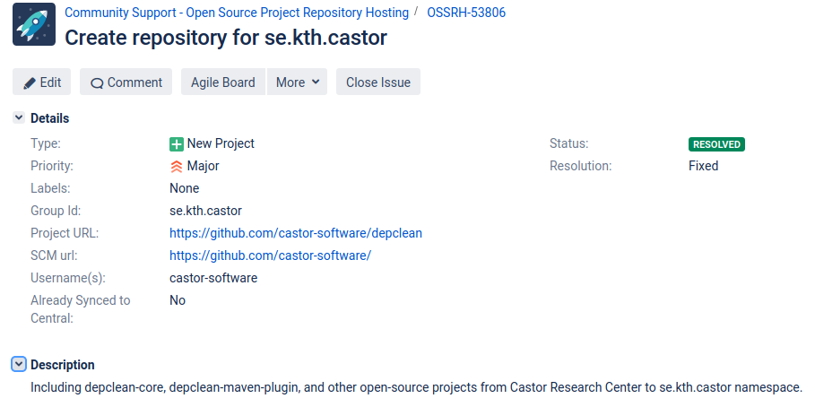

# Deploy Java artifacts to the CASTOR namespace in Maven Central

Maven Central is the de-facto repository for hosting software artifacts that compile to the JVM. Here we describe the process of releasing a new artifact in Maven Central following an step-by-step approach. 

## Table of content

* [1. Create a JIRA ticket in Sonatype](#1-create-a-jira-ticket-in-sonatype)
* [2. Configuring the POM](#2-configuring-the-pom)
* [3. Release to Maven Central](#3-release-to-maven-central)
* [References](#references)

## 1. Create a JIRA ticket in Sonatype

First, you need to create a JIRA account and submit a ticket there requesting adding your project artifact coordinates (groupId:artifactId:version) to the namespace `se.kth.castor` in Sonatype:

1.  [Create a JIRA account](https://issues.sonatype.org/secure/Signup!default.jspa)
2.  [Create a New Project ticket](https://issues.sonatype.org/secure/CreateIssue.jspa?issuetype=21&pid=10134)

A staging repository is already configured for the requested artifact's coordinates. You need to find someone with a deployer role in CASTOR that comment on the ticket to verify your request (e.g., you can contact [cesarsotovalero](https://github.com/cesarsotovalero)). Below is an example of a ticket that I created for the artifacts: `depclean-core` and `depclean-maven-plugin`.



The ticked review is a manual process, it normally takes less than 2 business days to be answered.

## 2. Configuring the POM

After the approval of the ticket, you need to provide additional information to the POM of the Maven project (or module) to be deployed. To do so, follow each of the steps below exactly as they are. Below is an example for the already released artifact `se.kth.castor:depclean-maven-plugin:1.0.0`

1. Choose appropriate coordinates as explained [here](https://central.sonatype.org/pages/choosing-your-coordinates.html):

    ```xml
    <groupId>se.kth.castor</groupId>
    <artifactId>depclean-maven-plugin</artifactId>
    <version>1.0.0</version>
    ```
 
2.  Add your project name, description, and URL:

    ```xml
    <name>depclean-maven-plugin</name>
    <description>DepClean is a plugin for automatically remove unused dependencies in Maven projects</description>
    <url>https://github.com/castor-software/depclean</url>
    ```
3. Add licence information:

    ```xml
    <licenses>
       <license>
          <name>MIT License</name>
          <url>http://www.opensource.org/licenses/mit-license.php</url>
          <distribution>repo</distribution>
       </license>
    </licenses>
    ```
4. Add information about developer/s :

    ```xml
     <developers>
         <developer>
            <id>cesarsotovalero</id>
            <name>César Soto Valero</name>
            <email>cesarsotovalero@gmail.com</email>
            <organization>Castor Software Research Centre</organization>
            <organizationUrl>https://www.castor.kth.se/</organizationUrl>
         </developer>
     </developers>
    ```

5. Add SCM information, the following example uses GitHub:

    ```xml
    <scm>
       <url>https://github.com/castor-software/depclean/</url>
       <connection>scm:git:git:github.com/castor-software/depclean.git</connection>
       <developerConnection>scm:git:git@github.com:castor-software/depclean.git</developerConnection>
    </scm>
    ```
    
6. Add distribution management and authentication to Sonatype via the `nexus-staging-maven-plugin`:

    ```xml
    <distributionManagement>
      <snapshotRepository>
        <id>ossrh</id>
        <url>https://oss.sonatype.org/content/repositories/snapshots</url>
      </snapshotRepository>
    </distributionManagement>
    <build>
      <plugins>
        <plugin>
          <groupId>org.sonatype.plugins</groupId>
          <artifactId>nexus-staging-maven-plugin</artifactId>
          <version>1.6.7</version>
          <extensions>true</extensions>
          <configuration>
            <serverId>ossrh</serverId>
            <nexusUrl>https://oss.sonatype.org/</nexusUrl>
            <autoReleaseAfterClose>true</autoReleaseAfterClose>
          </configuration>
        </plugin>
        ...
      </plugins>
    </build>
    ```
    
 7. Add javadoc and sources attachments using the `maven-javadoc-plugin` and  `maven-source-plugin` :
 
    ```xml
    <build>
      <plugins>
        <plugin>
          <groupId>org.apache.maven.plugins</groupId>
          <artifactId>maven-source-plugin</artifactId>
          <version>2.2.1</version>
          <executions>
            <execution>
              <id>attach-sources</id>
              <goals>
                <goal>jar-no-fork</goal>
              </goals>
            </execution>
          </executions>
        </plugin>
        <plugin>
          <groupId>org.apache.maven.plugins</groupId>
          <artifactId>maven-javadoc-plugin</artifactId>
          <version>2.9.1</version>
          <executions>
            <execution>
              <id>attach-javadocs</id>
              <goals>
                <goal>jar</goal>
              </goals>
            </execution>
          </executions>
        </plugin>
      </plugins>
    </build>
    ```
    
 8. Add GPG signed components using the `maven-gpg-plugin`:
 
     ```xml
    <build>
      <plugins>
        <plugin>
          <groupId>org.apache.maven.plugins</groupId>
          <artifactId>maven-gpg-plugin</artifactId>
          <version>1.5</version>
          <executions>
            <execution>
              <id>sign-artifacts</id>
              <phase>verify</phase>
              <goals>
                <goal>sign</goal>
              </goals>
            </execution>
          </executions>
        </plugin>
      </plugins>
    </build>
    ```

9. Follow [this instructions](https://central.sonatype.org/pages/working-with-pgp-signatures.html) to encrypt your artifact with [gpg2](https://linux.die.net/man/1/gpg2) and distribute your public key to a key server (e.g., [http://keys.gnupg.net](http://keys.gnupg.net)). Do not forget to choose a passphrase to protect your secret key. Then add your gpg credentials with your passphrase to your Maven`settings.xml` file locally:

     ```xml
    <settings>
      <profiles>
        <profile>
          <id>ossrh</id>
          <activation>
            <activeByDefault>true</activeByDefault>
          </activation>
          <properties>
            <gpg.executable>gpg2</gpg.executable>
            <gpg.passphrase>the_pass_phrase</gpg.passphrase>
          </properties>
        </profile>
      </profiles>
    </settings>
    ```
    
10. Add `nexus-staging-maven-plugin` with the following configurations:

    ```xml
    <build>
    <plugins>
      <plugin>
        <groupId>org.sonatype.plugins</groupId>
        <artifactId>nexus-staging-maven-plugin</artifactId>
        <version>1.6.7</version>
        <extensions>true</extensions>
        <configuration>
           <serverId>ossrh</serverId>
           <nexusUrl>https://oss.sonatype.org/</nexusUrl>
           <autoReleaseAfterClose>true</autoReleaseAfterClose>
        </configuration>
      </plugin>
    </plugins>
    ```

## 3. Release to Maven Central

Finally, run a deployment to OSSRH and an automated release to the Central Repository with the following command:

```bash
  mvn clean deploy
```

After this, the Central sync will be activated for your artifact. After you successfully deploy, your artifact will be published to Maven Central, typically within 10 minutes, though updates to [search.maven.org](https://search.maven.org) can take up to two hours.

## References

- [Apache Maven Official Instructions](https://maven.apache.org/repository/guide-central-repository-upload.html)
- [OSSRH Guide](https://central.sonatype.org/pages/ossrh-guide.html)
- [Tutorial on YouTube](https://www.youtube.com/watch?v=bxP9IuJbcDQ)


